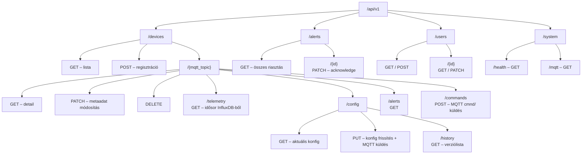

# FastAPI API Terv

## Eszköz azonosító konvenció

Az MQTT `%topic%` a MAC cím utolsó 3 bájtjából képzett 6 karakteres hex string – **firmware-előtag nélkül**.

| Formátum | Példa | Megjegyzés |
|---------|-------|------------|
| Régi (Tasmota default) | `tasmota_A1B2C3` | Firmware-specifikus, nem kívánt |
| **Választott** | `A1B2C3` | Firmware-agnosztikus, rövidebb |

**Tasmota beállítás:** a konzolon a `Topic A1B2C3` paranccsal kell felülírni az alapértelmezett `tasmota_%06X` értéket. Ezt az első provisioning során kell elvégezni (vagy egy `cmnd/tasmota_A1B2C3/Topic` → `A1B2C3` paranccsal, mielőtt átnevezzük).

**Következmény a MQTT topicokban:**
```
tele/A1B2C3/SENSOR    (korábban: tele/tasmota_A1B2C3/SENSOR)
cmnd/A1B2C3/POWER     (korábban: cmnd/tasmota_A1B2C3/POWER)
stat/A1B2C3/RESULT    (korábban: stat/tasmota_A1B2C3/RESULT)
```

## Erőforrás-térkép



---

## Endpoints – teljes táblázat

### Devices – `/api/v1/devices`

| Metódus | Path | Leírás | Forrás |
|---------|------|--------|--------|
| `GET` | `/devices` | Összes eszköz listája (online szűrő) | PostgreSQL |
| `POST` | `/devices` | Új eszköz manuális regisztrálása | PostgreSQL |
| `GET` | `/devices/{mqtt_topic}` | Egy eszköz részletei + aktuális állapot | PostgreSQL |
| `PATCH` | `/devices/{mqtt_topic}` | Display name, location módosítás | PostgreSQL |
| `DELETE` | `/devices/{mqtt_topic}` | Eszköz törlése a nyilvántartásból | PostgreSQL |
| `GET` | `/devices/{mqtt_topic}/telemetry` | Idősor lekérdezés | InfluxDB |
| `GET` | `/devices/{mqtt_topic}/config` | Aktuális konfig + státusz | PostgreSQL |
| `PUT` | `/devices/{mqtt_topic}/config` | Konfig frissítés → MQTT cmnd/ küldés | PostgreSQL + MQTT |
| `GET` | `/devices/{mqtt_topic}/config/history` | Konfig verziólista | PostgreSQL |
| `POST` | `/devices/{mqtt_topic}/commands` | Egyedi MQTT parancs küldés | MQTT |
| `GET` | `/devices/{mqtt_topic}/alerts` | Eszköz riasztásai | PostgreSQL |

### Alerts – `/api/v1/alerts`

| Metódus | Path | Leírás |
|---------|------|--------|
| `GET` | `/alerts` | Összes riasztás (szűrhető) |
| `PATCH` | `/alerts/{id}` | Riasztás nyugtázása |

### Users – `/api/v1/users`

| Metódus | Path | Leírás |
|---------|------|--------|
| `GET` | `/users` | Felhasználók listája |
| `POST` | `/users` | Új felhasználó |
| `GET` | `/users/{id}` | Felhasználó detail |
| `PATCH` | `/users/{id}` | Értesítési beállítások módosítása |

### System – `/api/v1/system`

| Metódus | Path | Leírás |
|---------|------|--------|
| `GET` | `/system/health` | Backend állapot (MQTT, PG, Influx) |
| `GET` | `/system/mqtt` | MQTT kapcsolat státusza |

---

## Pydantic sémák

### Device sémák (`schemas/device.py`)

```python
from pydantic import BaseModel, Field
from datetime import datetime

class DeviceCreate(BaseModel):
    mqtt_topic: str                     # A1B2C3 – MAC-alapú, firmware-agnosztikus, nem változtatható
    display_name: str                   # Hátsó udvar hőmérő
    device_type: str                    # temperature | relay | motion | unknown
    location: str | None = None

class DevicePatch(BaseModel):
    display_name: str | None = None
    location: str | None = None
    device_type: str | None = None

class DeviceOut(BaseModel):
    mqtt_topic: str
    display_name: str
    device_type: str
    location: str | None
    online: bool                        # LWT alapján
    last_seen: datetime | None
    wifi_rssi: int | None               # tele/STATE Signal mező
    uptime_sec: int | None              # tele/STATE UptimeSec mező
    config_version: int
    config_status: str                  # active | pending | failed
    created_at: datetime

    model_config = {"from_attributes": True}
```

### Telemetry sémák (`schemas/telemetry.py`)

```python
from datetime import datetime
from fastapi import Query

class TelemetryPoint(BaseModel):
    timestamp: datetime
    values: dict[str, float]            # {"temperature": 22.5, "humidity": 45.2}

class TelemetryOut(BaseModel):
    device_topic: str
    from_time: datetime
    to_time: datetime
    aggregation: str                    # raw | 5m | 1h | 1d
    count: int
    points: list[TelemetryPoint]

# Query paraméterek osztályként (Annotated Depends pattern)
class TelemetryQuery:
    def __init__(
        self,
        from_time: datetime = Query(..., alias="from"),
        to_time: datetime = Query(default_factory=datetime.utcnow, alias="to"),
        aggregation: str = Query(default="raw", pattern="^(raw|5m|1h|1d)$"),
        fields: list[str] = Query(default=[]),    # szűrés mezőre
        limit: int = Query(default=1000, le=10000),
    ): ...
```

### Config sémák (`schemas/config.py`)

> A séma neve `DeviceConfig` – firmware-agnosztikus. A mezők jelenleg Tasmota-parancsneveket tükröznek, de az `extra` dict bármilyen egyedi paramétert befogad.

```python
class DeviceConfig(BaseModel):
    teleperiod: int = Field(300, ge=10, le=3600, description="Telemetria küldési időköz (mp)")
    power_on_state: int = Field(3, ge=0, le=4)   # 0=off,1=on,2=toggle,3=saved
    power_retain: bool = False
    extra: dict[str, str] = {}                    # Egyéb cmnd/ parancsok kulcs-érték párban

class DeviceConfigOut(BaseModel):
    device_topic: str
    version: int
    status: str                         # active | pending | failed
    config: DeviceConfig
    applied_at: datetime | None
    created_at: datetime

class DeviceConfigHistoryOut(BaseModel):
    device_topic: str
    versions: list[DeviceConfigOut]
```

### Command séma (`schemas/command.py`)

```python
class CommandRequest(BaseModel):
    command: str = Field(..., example="POWER")       # Tasmota parancs neve
    payload: str = Field(default="", example="ON")   # Payload (üres = lekérdezés)

class CommandResponse(BaseModel):
    device_topic: str
    command: str
    payload: str
    topic_published: str                # pl. "cmnd/A1B2C3/POWER"
    sent_at: datetime
    mqtt_connected: bool
```

### Alert sémák (`schemas/alert.py`)

```python
class AlertOut(BaseModel):
    id: int
    device_topic: str
    display_name: str
    alert_type: str      # offline | telemetry_gap | config_fail | custom
    severity: str        # info | warning | critical
    message: str
    acknowledged: bool
    acknowledged_by: str | None
    acknowledged_at: datetime | None
    created_at: datetime
    resolved_at: datetime | None

class AlertAck(BaseModel):
    acknowledged_by: str

# GET /alerts query paraméterek
class AlertQuery:
    def __init__(
        self,
        device_topic: str | None = Query(default=None),
        acknowledged: bool | None = Query(default=None),
        severity: str | None = Query(default=None, pattern="^(info|warning|critical)$"),
        limit: int = Query(default=50, le=500),
        offset: int = Query(default=0),
    ): ...
```

### User sémák (`schemas/user.py`)

```python
class NotificationSettings(BaseModel):
    email_enabled: bool = True
    email_address: str | None = None
    sms_enabled: bool = False
    phone_number: str | None = None     # E.164 formátum, pl. +381612345678

class UserCreate(BaseModel):
    name: str
    email: str
    notifications: NotificationSettings = NotificationSettings()

class UserOut(BaseModel):
    id: int
    name: str
    email: str
    notifications: NotificationSettings
    created_at: datetime
```

### System sémák (`schemas/system.py`)

```python
class SystemHealth(BaseModel):
    status: str                  # ok | degraded
    mqtt_connected: bool
    postgres_ok: bool
    influxdb_ok: bool
    device_count: int
    online_device_count: int
    timestamp: datetime
```

---

## Hibakezelés – egységes error response

Minden hiba azonos formátumú választ ad:

```python
# main.py – exception handler
class ErrorResponse(BaseModel):
    error: str       # gép-olvasható kód: "device_not_found", "mqtt_disconnected"
    message: str     # emberi üzenet
    detail: str | None = None

# HTTP státuszkódok
# 404 – eszköz / riasztás nem található
# 409 – mqtt_topic már létezik (DeviceCreate)
# 503 – MQTT broker nem elérhető (Command, Config PUT)
# 422 – validációs hiba (Pydantic automatikusan)
```

---

## Router struktúra (`api/v1/router.py`)

```python
from fastapi import APIRouter
from .devices import router as devices_router
from .telemetry import router as telemetry_router
from .config import router as config_router
from .commands import router as commands_router
from .alerts import router as alerts_router
from .users import router as users_router
from .system import router as system_router

v1_router = APIRouter(prefix="/api/v1")
v1_router.include_router(devices_router,   prefix="/devices",        tags=["devices"])
v1_router.include_router(telemetry_router, prefix="/devices",        tags=["telemetry"])
v1_router.include_router(config_router,    prefix="/devices",        tags=["config"])
v1_router.include_router(commands_router,  prefix="/devices",        tags=["commands"])
v1_router.include_router(alerts_router,    prefix="/alerts",         tags=["alerts"])
v1_router.include_router(users_router,     prefix="/users",          tags=["users"])
v1_router.include_router(system_router,    prefix="/system",         tags=["system"])
```

---

## Fontos route-ok részletezve

### `PUT /devices/{mqtt_topic}/config` – konfig + MQTT küldés

```
1. Validálás (Pydantic TasmotaConfig)
2. PostgreSQL: új konfig verzió mentése, status="pending"
3. Minden config mező → cmnd/{mqtt_topic}/{param} MQTT publish
4. Ha MQTT disconnected → 503 visszaadása (DB mentés rollback)
5. Válasz: DeviceConfigOut (status="pending", version=N)
6. Háttérben: stat/ visszajelzés érkezésekor status="active"
```

### `POST /devices/{mqtt_topic}/commands` – közvetlen MQTT parancs

```
1. Validálás (CommandRequest)
2. MQTT connect check: ha None → 503
3. Publish: cmnd/{mqtt_topic}/{command} payload={payload}
4. Válasz: CommandResponse (mqtt_connected=True, topic_published=...)
   Nincs várakozás a stat/ visszajelzésre – fire-and-forget
```

### `GET /devices/{mqtt_topic}/telemetry` – InfluxDB lekérdezés

```
Flux query sablon:
  from(bucket: "smartblue")
    |> range(start: from_time, stop: to_time)
    |> filter(fn: (r) => r.device_topic == mqtt_topic)
    |> aggregateWindow(every: aggregation, fn: mean)
    |> yield()
```

---

## Fájlonkénti feladatlista

- `schemas/device.py` – DeviceCreate, DevicePatch, DeviceOut
- `schemas/telemetry.py` – TelemetryPoint, TelemetryOut, TelemetryQuery
- `schemas/config.py` – TasmotaConfig, DeviceConfigOut, DeviceConfigHistoryOut
- `schemas/command.py` – CommandRequest, CommandResponse
- `schemas/alert.py` – AlertOut, AlertAck, AlertQuery
- `schemas/user.py` – UserCreate, UserOut, NotificationSettings
- `schemas/system.py` – SystemHealth
- `api/v1/devices.py` – CRUD + list
- `api/v1/telemetry.py` – GET telemetry
- `api/v1/config.py` – GET/PUT config + history
- `api/v1/commands.py` – POST command
- `api/v1/alerts.py` – GET list + PATCH ack
- `api/v1/users.py` – GET/POST/PATCH
- `api/v1/system.py` – health + mqtt status
