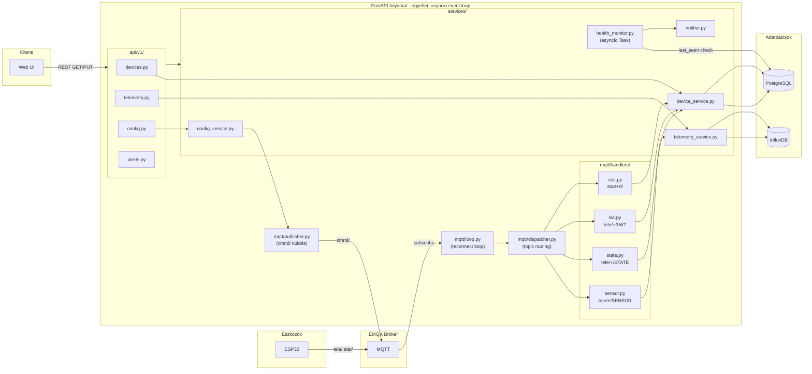

# Python Backend Architektúra Terv

## Miért jó ez a választás?

FastAPI és aiomqtt mindkettő `asyncio`-alapú – ugyanazon az event loop-on futnak, nem blokkolják egymást. Az MQTT listener egy háttér-`Task`, a FastAPI route-ok párhuzamosan futhatnak mellette. Ez egyszerű, jól tesztelhető, és a pilot fázishoz tökéletesen elegendő.

## Adatfolyam



## Könyvtárstruktúra

```
backend/
├── app/
│   ├── main.py                  # FastAPI app + lifespan (MQTT task + health task indítás)
│   ├── core/
│   │   └── config.py            # pydantic-settings: MQTT host, DB URL, stb. (.env-ből)
│   ├── mqtt/
│   │   ├── loop.py              # Reconnect loop (while True + MqttError catch)
│   │   ├── dispatcher.py        # topic split → match/case → handler hívás
│   │   ├── publisher.py         # app.state.mqtt_client-en keresztül cmnd/ publikálás
│   │   └── handlers/
│   │       ├── sensor.py        # tele/+/SENSOR → InfluxDB
│   │       ├── state.py         # tele/+/STATE → PostgreSQL last_seen, wifi_rssi
│   │       ├── lwt.py           # tele/+/LWT → PostgreSQL online/offline státusz
│   │       └── stat.py          # stat/+/# → konfig ACK feldolgozás
│   ├── api/v1/
│   │   ├── router.py            # APIRouter összefogó
│   │   ├── devices.py           # GET /devices, GET /devices/{id}
│   │   ├── telemetry.py         # GET /devices/{id}/telemetry (InfluxDB)
│   │   ├── config.py            # GET/PUT /devices/{id}/config
│   │   └── alerts.py            # GET /devices/{id}/alerts
│   ├── db/
│   │   ├── postgres.py          # SQLAlchemy async_engine + AsyncSession factory
│   │   ├── influx.py            # InfluxDB write_api + query_api wrapperek
│   │   └── models/              # SQLAlchemy ORM modellek
│   ├── schemas/                 # Pydantic request/response modellek
│   ├── services/
│   │   ├── device_service.py    # Eszköz CRUD, státusz frissítés
│   │   ├── telemetry_service.py # InfluxDB írás/olvasás
│   │   ├── config_service.py    # Konfig verziókezelés + MQTT cmnd/ küldés
│   │   ├── health_monitor.py    # Háttér asyncio.Task: last_seen poll + riasztás
│   │   └── notifier.py          # Email (aiosmtplib) + SMS (Infobip)
│   └── dependencies.py          # Depends(get_session), Depends(get_mqtt_publisher)
├── alembic/                     # DB migrációk
├── tests/
├── .env.example
├── Dockerfile
└── requirements.txt
```

## Kulcsminták

### 1. Lifespan – minden háttérfeladat indítása (`main.py`)

```python
@asynccontextmanager
async def lifespan(app: FastAPI):
    task_mqtt = asyncio.create_task(mqtt_loop(app))
    task_health = asyncio.create_task(health_monitor_loop())
    yield
    task_mqtt.cancel()
    task_health.cancel()
```

### 2. Robusztus MQTT reconnect loop (`mqtt/loop.py`)

```python
async def mqtt_loop(app: FastAPI):
    while True:
        try:
            async with aiomqtt.Client(settings.MQTT_HOST) as client:
                await client.subscribe("tele/+/SENSOR")
                await client.subscribe("tele/+/STATE")
                await client.subscribe("tele/+/LWT")
                await client.subscribe("stat/+/#")
                app.state.mqtt_client = client      # publisher számára
                async for message in client.messages:
                    await dispatch(message)
        except aiomqtt.MqttError:
            app.state.mqtt_client = None
            await asyncio.sleep(5)                  # reconnect várakozás
```

### 3. DB session – kétféle kontextus

- **API route-ban** (request context): `Depends(get_session)` – FastAPI kezeli
- **MQTT handler-ben** (nincs request context): `async with async_session() as db:`

### 4. Publisher hozzáférése API route-ból

```python
# dependencies.py
def get_mqtt_publisher(request: Request) -> MqttPublisher:
    return MqttPublisher(client=request.app.state.mqtt_client)

# config.py route
@router.put("/{id}/config")
async def update_config(id: str, publisher=Depends(get_mqtt_publisher), ...):
    await config_service.apply(id, config, publisher)
```

## Technológiai függőségek (`requirements.txt`)

- `fastapi`, `uvicorn[standard]`
- `aiomqtt`
- `sqlalchemy[asyncio]`, `asyncpg`, `alembic`
- `influxdb-client[async]`
- `pydantic-settings`
- `aiosmtplib`, `jinja2` (email)
- `httpx` (Infobip SMS API)

## Ami még nyitott (nem blokkolja az implementációt)

- EMQX eszköz autentikáció módja (user/pass egyelőre elegendő)
- Dashboard / UI technológia
- EMQX Rule Engine vs FastAPI → InfluxDB (eldönthető implementáció közben)
