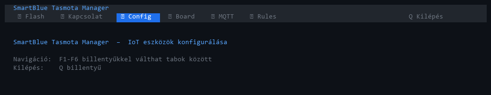
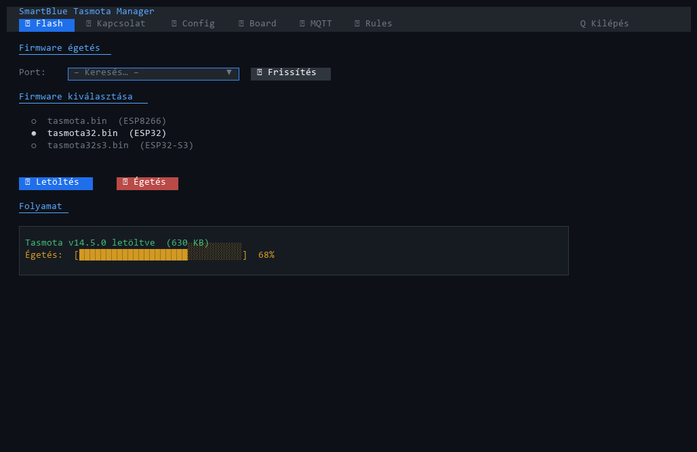
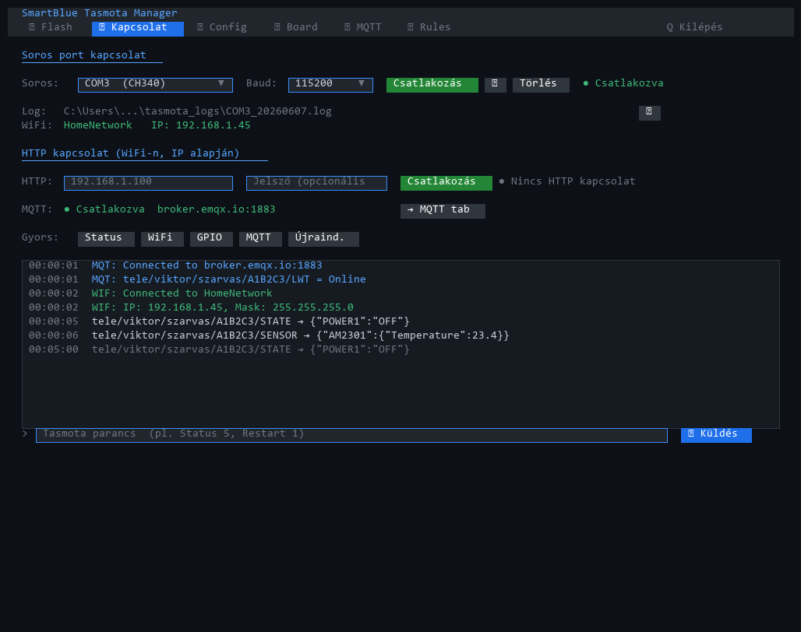
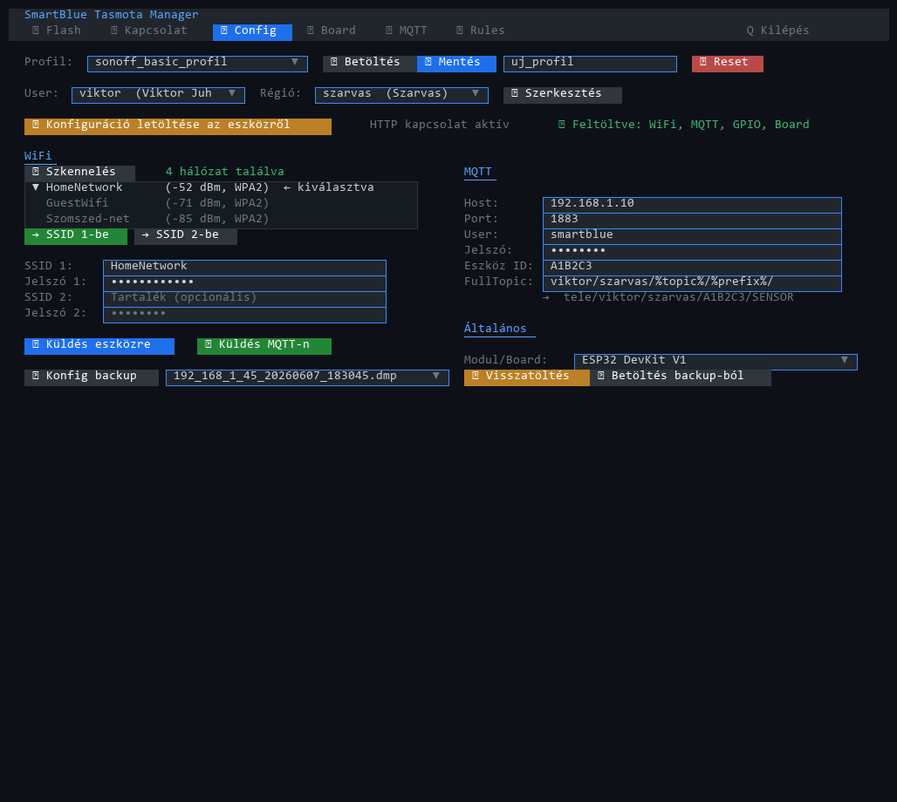
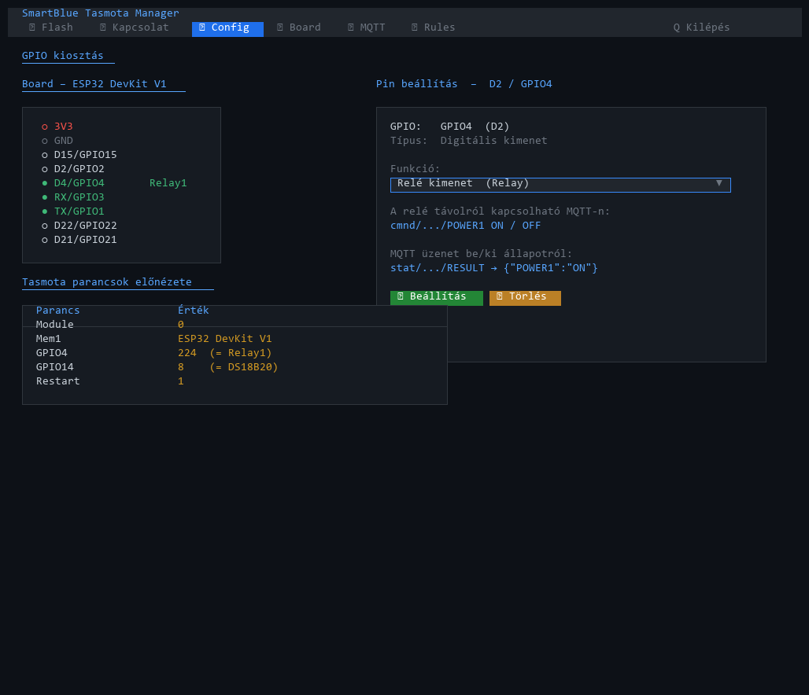
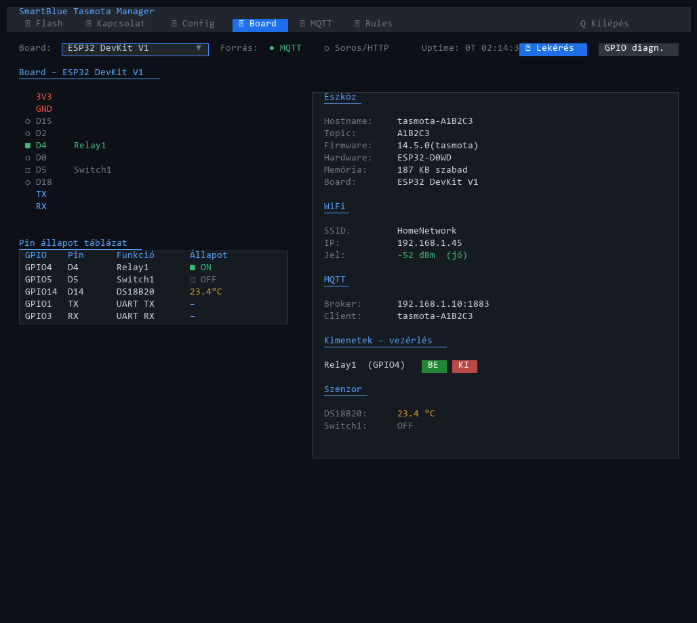
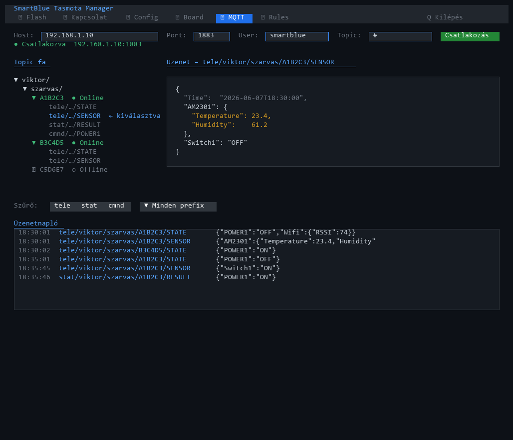
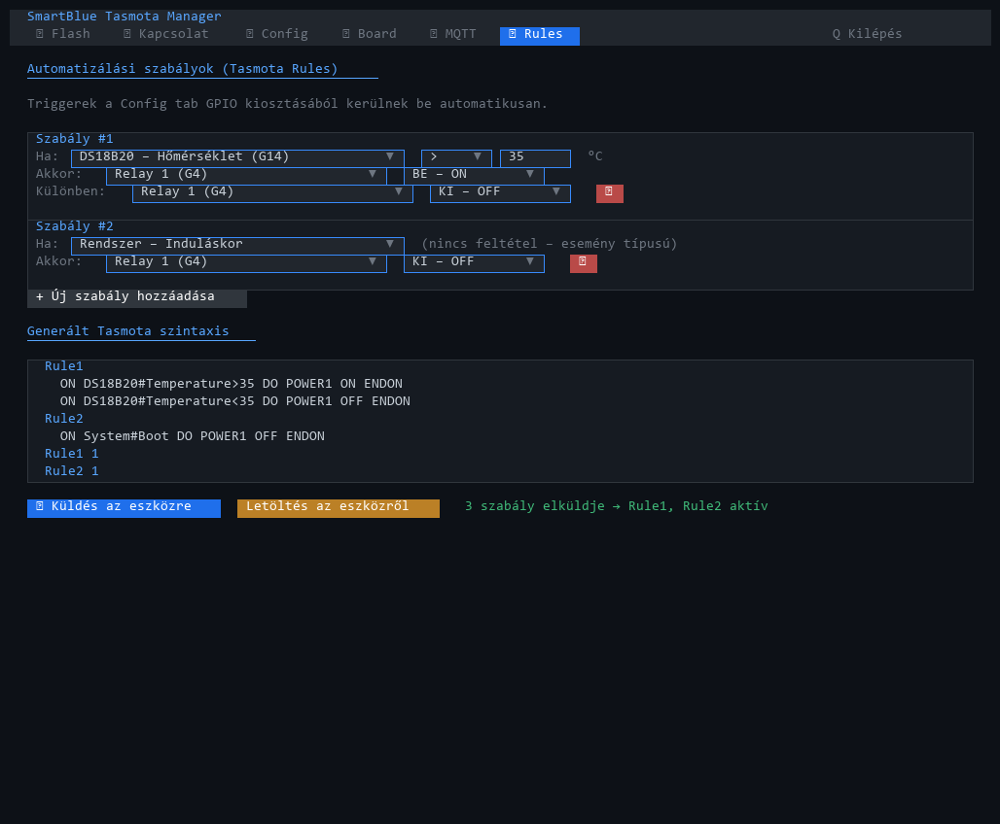

# SmartBlue Tasmota Manager – Felhasználói kézikönyv

> **Verzió:** 2026-06-07  
> **Célközönség:** Zsolti (Sogi), Robi, Alfréd – helyszíni üzembe helyezők  
> **Képernyőképek:** [`screenshots/HOW-TO-UPDATE.md`](screenshots/HOW-TO-UPDATE.md)

---

## Tartalom

1. [Előfeltételek és elindítás](#1-előfeltételek-és-elindítás)
2. [Flash tab – Firmware égetés](#2-flash-tab--firmware-égetés)
3. [Kapcsolat tab – Csatlakozás az eszközhöz](#3-kapcsolat-tab--csatlakozás-az-eszközhöz)
4. [Config tab – Eszköz konfigurálása](#4-config-tab--eszköz-konfigurálása)
5. [Board tab – Vizuális pin térkép és eszköz állapot](#5-board-tab--vizuális-pin-térkép-és-eszköz-állapot)
6. [MQTT Monitor tab – Broker figyelés](#6-mqtt-monitor-tab--broker-figyelés)
7. [Rules tab – Automatizálási szabályok](#7-rules-tab--automatizálási-szabályok)
8. [Tipikus munkafolyamat – Új eszköz üzembe helyezése](#8-tipikus-munkafolyamat--új-eszköz-üzembe-helyezése)
9. [Hibaelhárítás](#9-hibaelhárítás)

---

## 1. Előfeltételek és elindítás

### Hardver

- USB-soros adapter (CH340 vagy CP2102 chip alapú – legtöbb ESP fejlesztői panelen beépített)
- ESP32 vagy ESP8266 alapú eszköz (Wemos D1 Mini, NodeMCU, ESP32 DevKit, Sonoff stb.)
- Adatátviteli USB kábel (nem minden USB kábel adatátviteli – egyes kábelek csak töltők!)

### Driver telepítés (Windows)

Ha az eszköz nem jelenik meg a portlistában, telepítsd az USB-soros chip driverét:

| Chip | Driver letöltés |
|------|-----------------|
| **CH340 / CH341** | https://www.wch-ic.com/downloads/CH341SER_EXE.html |
| **CP2102** (Silicon Labs) | https://www.silabs.com/developers/usb-to-uart-bridge-vcp-drivers |

> ⚠️ Driver telepítés után **újra kell indítani** a számítógépet.

### Az alkalmazás futtatása

A kicsomagolt mappán belül kattints duplán az `.exe`-re:

```
SmartBlue-TasmotaManager\
    SmartBlue-TasmotaManager.exe   ← ez az indítóprogram
    _internal\                     ← ez mindig az exe mellett kell lenni!
```

> ⚠️ Az `_internal\` mappa kötelező melléklet – nélküle az alkalmazás nem indul el.  
> Ha máshová másolod az exe-t, az `_internal\` mappát is magaddal kell vinni.

Megnyílik egy fekete terminálablak a TUI felülettel. Az alkalmazás 6 tabból áll:

| Tab | Billentyű | Funkció |
|-----|-----------|---------|
| ⚡ Flash | F1 | Firmware letöltés és égetés |
| 🖥 Kapcsolat | F2 | Csatlakozás soros porton vagy WiFi-n (HTTP) |
| ⚙ Config | F3 | WiFi, MQTT, GPIO konfiguráció összeállítása és küldése |
| 🔌 Board | F4 | Vizuális pin térkép, élő eszköz állapot |
| 📡 MQTT | F5 | MQTT broker monitor, topic fa, payload viewer |
| 📋 Rules | F6 | Tasmota automatizálási szabályok vizuális szerkesztője |

**Kilépés:** `Q` billentyű



---

## 2. Flash tab – Firmware égetés

> Ezt a lépést csak akkor kell elvégezni, ha az eszközön még nincs Tasmota firmware,  
> vagy frissíteni kell a verziót. Ha az eszközön már fut Tasmota, ugorj a [3. fejezetre](#3-kapcsolat-tab--csatlakozás-az-eszközhöz).



### Az égetés lépései

**1. lépés – Eszköz csatlakoztatása és port kiválasztása**

Csatlakoztasd az ESP-t USB-n. Kattints az **↺ Frissítés** gombra – a legördülő listában megjelenik az eszköz portja (pl. `COM3`). Ha több port is van, húzd ki az ESP-t, nézd meg melyik tűnt el, majd csatlakoztasd vissza – az lesz a helyes port.

**2. lépés – Firmware kiválasztása**

| Firmware | Mikor válaszd |
|---------|---------------|
| `tasmota.bin` | ESP8266 alapú eszközök: Wemos D1 Mini, NodeMCU v3, Sonoff Basic/S20/TH/4CH/Mini |
| `tasmota-lite.bin` | ESP8266, ha kevés a flash memória (régebbi eszközök) |
| `tasmota32.bin` | ESP32 alapú fejlesztői panelek (DevKit V1, ESP-WROOM-32) |
| `tasmota32s3.bin` | ESP32-S3 alapú panelek |

**3. lépés – Letöltés**

Kattints a **⬇ Letöltés** gombra. Az alkalmazás letölti a legfrissebb verziót a Tasmota GitHub oldaláról. A letöltés előrehaladása a „Folyamat" ablakban látható.

**4. lépés – Égetés**

Kattints a **🔥 Égetés** gombra. Az égetés előtt a szoftver törli a flash memóriát, majd feltölti az új firmware-t.

> ⚠️ **Égetés közben ne húzd ki az eszközt!**  
> Az égetés általában 30-90 másodpercet vesz igénybe.  
> Ha az égetés leáll `Failed to connect` hibával: tartsd lenyomva az ESP32 BOOT gombját az égetés elindítása után, majd engedd el, amikor a „Connecting…" felirat megjelenik.

**5. lépés – Sikeres égetés után**

Az eszköz újraindul és Tasmota AccessPointot nyit:  
`tasmota-XXXXXX` nevű WiFi hálózat jelenik meg, IP: `192.168.4.1`.  
Ezután a Config tabban konfigurálhatod az eszközt.

---

## 3. Kapcsolat tab – Csatlakozás az eszközhöz

> Az alkalmazás kétféleképpen tud kommunikálni egy Tasmota eszközzel:  
> **Soros porton** (USB kábellel), vagy **HTTP API-n** (WiFi hálózaton, IP-cím alapján).  
> Mindkét módban ugyanazokat a funkciókat éred el.



### 3.1 Soros port kapcsolat (USB kábellel)

Ez a módszer az eszköz fizikai USB csatlakoztatásával működik.

**Csatlakozás:**
1. Válaszd ki a **portot** (pl. `COM3`) a legördülő listából
2. A **baud ráta** maradjon `115200` (ez a Tasmota alapértelmezése)
3. Kattints a **Csatlakozás** gombra
4. A log ablakban megjelenik az eszköz élő kimenete – induláskor a Tasmota boot üzenetei láthatók

**Állapotjelző sor:**
- `● Csatlakozva COM3` zöld felirat – aktív kapcsolat
- `WiFi: HomeNetwork  IP: 192.168.1.45` – az eszköz aktuális WiFi állapota (ha be van állítva)

**Log fájl:** A soros kapcsolat összes üzenete automatikusan mentésre kerül egy log fájlba. A sorban látható a fájl elérési útja, a **📂** gombbal megnyithatod a mappát.

**Lecsatlakozás:** Kattints újra a gombra (ami most „Lecsatlakozás" feliratú), vagy húzd ki az USB kábelt.

---

### 3.2 HTTP kapcsolat (WiFi hálózaton)


Ha az eszköz már csatlakozik a WiFi hálózathoz és ismered az IP-címét, nem kell USB kábel.

**Csatlakozás:**
1. Add meg az **IP-cimet** a mezőbe (pl. `192.168.1.45`)
2. Ha az eszközön be van állítva webes jelszó (Tasmota → Configuration → Password), add meg a **jelszót** is a második mezőbe
3. Kattints a **Csatlakozás** gombra

> 💡 Az eszköz IP-cíeme megtalálható:
> - A router admin felületén (általában `192.168.1.1` vagy `192.168.0.1`)
> - Soros kapcsolaton keresztül a `Status 5` parancs kimenetéből
> - A Tasmota webes felületén (`http://<ip>/`)

**Fontos különbség HTTP módban:** Az HTTP kapcsolat nem valós idejű stream – minden parancs válasza azonnal megjelenik a log ablakban, de az eszköz folyamatos soros kimenetét (pl. szabályfutás logja) nem látod. A `Status` és konfigurációs parancsok teljesen egyenértékűek.

**Állapotjelző:** `● HTTP kapcsolat: 192.168.1.45` zöld felirattal jelzi az aktív HTTP kapcsolatot.

---

### 3.3 MQTT állapot

A Kapcsolat tab alján egy sor mutatja az MQTT broker kapcsolat állapotát is (ezt az MQTT Monitor tabban lehet beállítani). A **→ MQTT tab** gombbal közvetlenül átnavigálhatsz.

---

### 3.4 Gyors parancsok

A log ablak felett egy sor gyorsgomb található a leggyakrabban használt Tasmota parancsokhoz:

| Gomb | Tasmota parancs | Mit mutat |
|------|----------------|-----------|
| Status | `Status` | Összefoglaló: eszköznév, topic, modul típusa |
| Wifi | `Status 5` | WiFi SSID, IP-cím, MAC cím, jelerősség |
| GPIO | `Status 11` | Minden GPIO aktuális be/ki állapota |
| MQTT | `Status 6` | MQTT broker host, port, user |
| Újraind. | `Restart 1` | Eszköz újraindítása |

---

### 3.5 Egyedi parancs küldése

Az ablak alján lévő beviteli mezőbe bármilyen Tasmota parancsot beírhatsz, majd Enter-rel vagy a **↵ Küldés** gombbal elküldheted az eszközre. A parancs és a válasz is megjelenik a logban.

Hasznos parancsok:
```
TelePeriod          # aktuális teleperiod értéke (mp)
TelePeriod 60       # teleperiod beállítása 60 másodpercre
GPIO4               # GPIO4 aktuális funkciója
WifiScan 1          # WiFi hálózatok keresése
Mem1                # Mem1 változó értéke (board típus)
Mem1 ESP32-DevKit   # Mem1 értékének beállítása
```

---

### 3.6 Log színkódolás

A log ablak sorai típus szerint el vannak színezve:

| Szín | Prefix | Jelentés |
|------|--------|---------|
| Cyan | `MQT:` | MQTT esemény (csatlakozás, üzenet küldés/fogadás) |
| Kék/zöld | `WIF:` | WiFi esemény |
| Piros | `ERR:` | Hiba |
| Narancs | `RST:` | Újraindítás |
| Fehér | egyéb | Általános Tasmota napló |

---

## 4. Config tab – Eszköz konfigurálása

> A Config tab az alkalmazás legfontosabb része: itt állítod össze a WiFi, MQTT és GPIO konfigurációt,  
> majd innen küldöd el az eszközre.



### 4.1 Profil kezelés

A tab legtetején a profil sor található:

- **Profil legördülő** – korábban elmentett konfigurációs profilok listája
- **📂 Betöltés** – betölti a kiválasztott profilt az összes mezőbe
- **💾 Mentés** – elmenti az aktuális mezők tartalmát a „Profil neve" mezőben megadott névvel, JSON fájlként a `profiles\` mappába
- **↺ Reset** – visszaállítja az összes mezőt az alapértelmezett értékekre (törli a beírott adatokat)

> 💡 Profilokkal gyorsan konfigurálhatsz több azonos típusú eszközt: egyszer töltsd ki a mezőket, mentsd el profil-ként, majd minden új eszköznél töltsd be és csak az eszköz azonosítóját (topic) módosítsd.

---

### 4.2 User / Régió (csoport) kiválasztás

A profil sor alatt a csoporthoz tartozást lehet beállítani:

- **User legördülő** – melyik felhasználóhoz/ügyfélhez tartozik az eszköz
- **Régió legördülő** – ezen belül melyik helyszínhez/régióhoz
- Ha mindkettőt kiválasztod, a FullTopic mező automatikusan frissül: `{user_id}/{regio_id}/%topic%/%prefix%/`

**⚙ Szerkesztés gomb** – megnyit egy szerkesztő panelt, ahol új usereket és régiókat adhatsz hozzá, szerkeszthetsz és törölhetsz. A panel bal oldala a usereket, jobb oldala az adott userhez tartozó régiókat mutatja.

> **Azonosítók szabálya:** Az azonosítók (user ID, régió ID, eszköz topic) csak MQTT-kompatibilis karaktereket tartalmazhatnak. A szóközök automatikusan `_`-ra cserélődnek, a `#`, `+`, `/` karakterek törlődnek – ezt az alkalmazás valós időben elvégzi gépelés közben.

---

### 4.3 Konfiguráció letöltése az eszközről

Ha az eszköz már csatlakozik (soros vagy HTTP), a **📥 Konfiguráció letöltése az eszközről** gomb megnyomásával az alkalmazás lekérdezi az eszköz összes aktuális beállítását, és automatikusan kitölti a Config tab mezőit:

- WiFi SSID1/SSID2 (a jelszavakat a Tasmota biztonsági okokból soha nem adja vissza)
- MQTT host, port, user, topic, FullTopic
- Modul/Board típusa
- GPIO kiosztás (melyik pin mire van beállítva)
- Board típus a Mem1-ből (ha korábban be volt állítva)

> Ez az ajánlott kiindulópont meglévő eszköznél – nem kell semmit kézzel beírni.  
> A jelszavakat viszont minden küldéskor kézzel kell megadni, mert az eszköz soha nem adja vissza őket.

---

### 4.4 WiFi beállítások


#### WiFi szkennelés

A WiFi panelen a legfelső gomb a **📡 Szkennelés**. Ez egy különösen hasznos funkció:

Amikor megnyomod a gombot, az alkalmazás elküldi a Tasmota `WifiScan 1` parancsát az eszközre. Az eszköz maga elvégzi a rádiós WiFi szkennelést – megnézi, hogy abban a pillanatban milyen WiFi hálózatokat lát a fizikai elhelyezési helyéről. Ez 4-10 másodpercet vesz igénybe, közben a gomb felirata jelzi az előrehaladást (`Szkennelés… (8 mp hátra)`, majd `3 hálózat eddig – várakozás…`).

Amikor a szkennelés befejeződött, megjelenik egy lista az összes talált hálózatról:
```
HomeNetwork    (-52 dBm, WPA2)
GuestWifi      (-71 dBm, WPA2)
Szomszed-net   (-85 dBm, WPA2)
```
Minden hálózatnál látható az SSID neve, a jelerősség (minél kevésbé negatív, annál erősebb – pl. -52 dBm erősebb, mint -85 dBm), és a titkosítás típusa.

**Kiválasztás és beillesztés:**  
Kattints a kívánt hálózatra a listában, majd nyomj:
- **→ SSID 1-be** – beírja az SSID nevét az SSID1 mezőbe (mint elsődleges hálózat)
- **→ SSID 2-be** – beírja az SSID nevét az SSID2 mezőbe (mint tartalék hálózat)

> ⚠️ A jelszó **nem kerül be automatikusan** – a WiFi hálózat jelszavát az eszköz nem tudja visszaadni, azt mindig kézzel kell begépelni.

#### WiFi mezők

| Mező | Leírás |
|------|--------|
| SSID 1 | Az elsődleges WiFi hálózat neve (legfontosabb, ezt használja az eszköz) |
| Jelszó 1 | Az elsődleges hálózat jelszava (kötelező, ha van jelszó) |
| SSID 2 | Tartalék WiFi hálózat neve (opcionális – ha SSID1 nem elérhető, erre vált) |
| Jelszó 2 | A tartalék hálózat jelszava |

> 💡 A tartalék hálózat (SSID2) különösen hasznos terepi telepítéseknél: beállítható például a helyi routernek ÉS egy mobil hotspotnak is egyszerre.

---

### 4.5 MQTT beállítások

| Mező | Leírás | Példa |
|------|--------|-------|
| Host | Az MQTT broker IP-je vagy domain neve | `192.168.1.10` vagy `broker.emqx.io` |
| Port | Az MQTT broker portja | `1883` (alap, titkosítatlan) |
| User | Broker felhasználónév (ha a broker hitelesítést kér) | `smartblue` |
| Jelszó | Broker jelszó | – |
| Eszköz azonosító | Az eszköz egyedi neve – ez lesz az MQTT topic részei | `A1B2C3` |
| FullTopic | Az MQTT topic teljes sablonformátuma | `%prefix%/%topic%/` |

**FullTopic előnézet:**  
A FullTopic mező alatt egy sor mutatja, hogyan fognak kinézni az aktuális beállításokkal a tényleges MQTT topicok. Például ha user: `viktor`, régió: `szarvas`, topic: `A1B2C3`:
```
cmnd/viktor/szarvas/A1B2C3/POWER1
stat/viktor/szarvas/A1B2C3/RESULT
tele/viktor/szarvas/A1B2C3/SENSOR
```

> ⚠️ Az eszköz azonosítóban (topic) csak betűk, számok és aláhúzás (`_`) megengedett.  
> Szóköz → `_`, tiltott karakterek (`#`, `+`, `/`) automatikusan törlődnek.

---

### 4.6 Modul / Board típus

Az MQTT panel alatti „Általános" részben egy legördülő menü található a **Modul / Board** kiválasztásához.

Ez két dolgot jelent egyszerre:
1. **Tasmota Module parancs** – megmondja a Tasmota-nak, milyen típusú hardverre fut (pl. ESP32 Generic = Module 0, Generic ESP8266 = Module 18, Sonoff Basic = Module 1)
2. **SmartBlue board rajz** – meghatározza, milyen vizuális PIN layout jelenjen meg a GPIO kiosztásnál

Ha ismert eszközt választasz (pl. Sonoff 4CH), az alkalmazás automatikusan kitölti az alapértelmezett GPIO kiosztást (a négy gomb és négy relé pin-jeivel).

---

### 4.7 GPIO kiosztás



A GPIO panel mutatja az eszköz lábkiosztását. Bal oldalon a board vizuális rajza, jobb oldalon a kiválasztott pin beállítása.

#### Hogyan rendeld hozzá a funkciókat

1. **Kattints egy pinre** a board rajzán – a pin kiemelődik, és a jobb oldalon megjelenik a „Pin beállítás" panel
2. A panel mutatja a pin nevét (pl. `D1 / GPIO5`) és egy figyelmeztetést boot-érzékeny pinekre (⚠)
3. A **Funkció** legördülőből válaszd ki a pin szerepét:

| Funkció | Mire való | Mit küld MQTT-n |
|---------|-----------|----------------|
| Nyomógomb | Fizikai nyomógomb – impulzusra reagál | `{"Button1":{"Action":"SINGLE"}}` |
| Kapcsoló bemenet | Be/Ki állapot jelzőjel (pl. relé visszajelző, ajtóérzékelő) | `{"Switch1":"ON"}` |
| PIR mozgásérzékelő | Mozgásdetektáló szenzor | `{"Switch1":"ON"}` |
| Relé kimenet | Kapcsolóvezérlés – ezt az MQTT-n be/ki lehet kapcsolni | `cmnd/.../POWER1 ON` |
| DHT22 hőmérséklet+pára | AM2301 szenzor az adatvonalra | `{"AM2301":{"Temperature":23.4,"Humidity":61}}` |
| DS18B20 hőmérséklet | 1-Wire digitális hőmérő | `{"DS18B20":{"Temperature":23.4}}` |
| LED | Állapotjelző LED | – |
| I2C SDA | I2C busz adatvezeték (pl. OLED kijelzőhöz) | – |
| I2C SCL | I2C busz órajel | – |
| PWM kimenet | Dimmelhető LED vagy motor fordulatszám szabályozás | – |

4. A funkció kiválasztása után alatta megjelenik a **funkció leírása** és a várható **MQTT üzenet formátuma**
5. Kattints a **✓ Beállítás** gombra a funkció mentéséhez, vagy **✗ Törlés** a pin funkcióinak törléséhez

**Automatikus sorszámozás:** Az alkalmazás automatikusan kioszt sorszámokat. Ha például három pinen is „Kapcsoló bemenet" funkciót állítottál be, ezek Switch1, Switch2, Switch3 lesznek (GPIO-szám sorrendben). A board diagramon a pineken látható felirat is frissül: pl. `D1 Relay2`.

#### Alapértelmezett kiosztások

Ismert eszközöknél a board típus kiválasztásakor az alkalmazás automatikusan betölti a gyári kiosztást:

| Eszköz | Automatikus kiosztás |
|--------|---------------------|
| Sonoff Basic | GPIO0 = Gomb, GPIO12 = Relé1, GPIO13 = LED |
| Sonoff S20 | GPIO0 = Gomb, GPIO12 = Relé1, GPIO13 = LED |
| Sonoff 4CH | GPIO0/9/10/14 = 4×Gomb, GPIO4/5/12/13 = 4×Relé |
| Sonoff TH | + GPIO14 = szenzor |
| Sonoff Mini | GPIO0 = Gomb, GPIO1 = Relé1 |

---

### 4.8 Tasmota parancsok előnézete

A GPIO kiosztás alatt egy táblázat mutatja az összes Tasmota parancsot, amit az alkalmazás el fog küldeni a jelenlegi beállítások alapján. Ez segít ellenőrizni, hogy mindent helyesen állítottál-e be, mielőtt ténylegesen elküldenéd az eszközre.

Például:
```
Parancs      Érték
──────────   ────────────────
Ssid1        HomeNetwork
Password1    ●●●●●●●●
MqttHost     192.168.1.10
MqttPort     1883
Topic        A1B2C3
FullTopic    viktor/szarvas/%topic%/%prefix%/
Module       0
Mem1         ESP32 DevKit V1
GPIO5        225    (= Switch1)
GPIO4        224    (= Relay1)
Restart      1
```

---

### 4.9 Konfiguráció küldése az eszközre

Miután minden mezőt kitöltöttél, két módón küldheted el az eszközre:

#### 📡 Küldés eszközre (soros vagy HTTP)

Ez az ajánlott módszer. Az alkalmazás három fázisban küldi el a konfigurációt:

1. **1. fázis:** WiFi, MQTT, TelePeriod és egyéb általános beállítások
2. **2. fázis:** Ha a Module (hardver típus) változott, az alkalmazás elküldi a Module parancsot. Ez **az eszköz újraindulását okozza** – az alkalmazás automatikusan 6 másodpercet vár, hogy az eszköz visszajöjjön
3. **3. fázis:** GPIO kiosztás + `Restart 1` parancs az eszközre

> ⚠️ A konfiguráció küldése után az eszköz újraindul és csatlakozik a beállított WiFi hálózathoz.  
> Soros logban látható lesz a boot folyamat és a WiFi csatlakozás.

#### 📡 Küldés MQTT-n

Ha az MQTT Monitor tabban már be van állítva egy aktív broker kapcsolat, a konfiguráció MQTT parancsok formájában is elküldhető (`cmnd/{topic}/...`). Ez akkor hasznos, ha az eszköz már üzemel és csak egy-egy beállítást akarsz módosítani anélkül, hogy USB kábelt kellene dugni.

---

### 4.10 Konfig backup és visszatöltés

A tab alján a backup sor tartalmazza ezeket a lehetőségeket (csak HTTP kapcsolatban elérhetők):

#### 💾 Konfig backup

Letölti az eszköz teljes konfigurációját bináris `.dmp` formátumban a `backups\` mappába. A fájlnév tartalmazza az eszköz IP-jét és a letöltés dátum-idejét (pl. `192_168_1_45_20260607_183045.dmp`).

> A `.dmp` fájl az eszköz összes beállítását tartalmazza – ideális biztonsági mentésnek, mielőtt konfigurációs változtatásokat végzel.

#### 📤 Visszatöltés

A legördülőből kiválasztasz egy korábban letöltött `.dmp` fájlt, majd a **Visszatöltés** gombbal visszatöltöd az eszközre. Az eszköz automatikusan újraindul és a backup-olt beállításokkal indul el.

#### 📋 Betöltés backup-ból

A kiválasztott `.dmp` fájlból kiolvas minden paramétert és kitölti a Config tab mezőit – de **nem küldeti el az eszközre**. Ez lehetővé teszi, hogy ellenőrizd vagy módosítsd a mentett konfigurációt, mielőtt visszatöltenéd.

---

## 5. Board tab – Vizuális pin térkép és eszköz állapot

> A Board tab élő képet ad az eszköz fizikai állapotáról: milyen pinekre mi van kötve,  
> milyen az aktuális be/ki állapotuk, és általános eszközinformációk.



### 5.1 A controls sor

A tab tetején a következő vezérlők találhatók:

- **Board legördülő** – manuálisan kiválaszthatod a board típusát (pl. `Wemos D1 Mini`, `ESP32 DevKit V1`). Ha a Config tabban be van állítva board típus, vagy az eszközről le van kérve, automatikusan beáll
- **Forrás: MQTT / Soros+HTTP** – meghatározza, honnan frissüljön az állapot  
  - *MQTT:* az alkalmazás figyeli a broker üzeneteit (`tele/.../STATE`, `tele/.../SENSOR`) és automatikusan frissíti a pin állapotokat
  - *Soros+HTTP:* 10 másodpercenként automatikusan lekéri az eszköz állapotát
- **Uptime** – az eszköz bekapcsolása óta eltelt idő (pl. `0T 01:23:45`)
- **↺ Lekérés gomb** – azonnali, teljes adatlekérés az eszközről (GPIO kiosztás, Mem1 board típus, WiFi, MQTT, szenzor értékek)
- **GPIO diagn. gomb** – részletes GPIO diagnosztika futtatása

### 5.2 Board diagram és pin táblázat

A bal oldali hasábban két nézet van:

**Board diagram:** Vizuálisan mutatja az eszközt és a pin-eket, a pin-ek aktuális állapotával:
- Zöld `■` – aktív / HIGH (pl. relé bekapcsolva)
- Halvány `□` – inaktív / LOW
- `⚠` ikon – boot-érzékeny pin (GPIO0, GPIO2, GPIO15 az ESP8266-on)
- Sárga – ADC (analóg bemenet)
- Cyan – UART (soros kommunikáció)

**Pin állapot táblázat:** Az összes konfigurált pin listázva: GPIO szám, pin neve, funkció, aktuális állapot.

### 5.3 Eszközinformációk (jobb oldali panel)

Az eszközről lekérdezett adatok:

**Eszköz:**
- Hostname (pl. `tasmota-A1B2C3`)
- Topic (MQTT azonosító)
- Firmware verzió (pl. `14.5.0(tasmota)`)
- Hardware (pl. `ESP32-D0WD`)
- Szabad memória (Heap)
- Board típus (Mem1-ből)

**WiFi:**
- SSID (csatlakozott hálózat neve)
- IP-cím
- Jelerősség (RSSI, dBm-ben)

**MQTT:**
- Broker host és port
- Client ID
- Kapcsolatok száma (újracsatlakozások)

### 5.4 Kimenetek vezérlése

Ha vannak relé kimenetként konfigurált GPIO-k, a jobb oldali panelen megjelenik egy „Kimenetek – vezérlés" rész, ahol minden reléhez **BE** és **KI** gombok láthatók. Ezekkel közvetlenül kapcsolhatod a reléket az alkalmazásból.

### 5.5 Szenzor / Energiafogyasztás

Ha az eszközön szenzor van (hőmérséklet, páratartalom, áramfogyasztás-mérő), az aktuális mérési értékek itt jelennek meg, és az ↺ Lekérés vagy az MQTT automatikus frissítés hatására frissülnek.

---

## 6. MQTT Monitor tab – Broker figyelés

> Valós idejű megfigyelés: látható, hogy az eszközök milyen üzeneteket küldenek a brokernek.  
> Hasznos az eszköz helyes működésének ellenőrzéséhez és hibakereséshez.



### 6.1 Csatlakozás a brokerhez

A tab tetején a kapcsolati beállítások:

- **Host** – az MQTT broker IP-je vagy domain neve (ugyanaz, mint a Config tabban)
- **Port** – általában `1883`
- **User / Jelszó** – ha a broker hitelesítést kér
- **Topic szűrő** – alapértelmezetten `#` (minden üzenet); szűkíthető pl. `A1B2C3/#` ha csak egy eszközt akarsz figyelni

> 💡 Ha a Config tabban letöltötted a konfigurációt az eszközről, a broker adatok automatikusan átkerülnek ide – nem kell újra beírni.

Kattints a **Csatlakozás** gombra.

### 6.2 A három panel

**Bal panel – Topic fa:**  
Az összes eszköz hierarchikusan rendezve, ahogyan az MQTT topicok szervezve vannak. A fa megmutatja minden eszköz összes topicát (cmnd, stat, tele prefix-ekkel). Amelyik az utóbbi percben küldött üzenetet, `● Online` jelzést kap.

Kattints egy topicra – a jobb panelen megjelenik a hozzá tartozó utolsó üzenet tartalma.

**Jobb panel – Payload nézet:**  
A kiválasztott topichoz érkező legutóbbi üzenet JSON formátumban, olvashatóan megjelenítve. Például:
```json
{
  "Time": "2026-06-07T18:30:00",
  "POWER1": "ON",
  "POWER2": "OFF",
  "Wifi": {
    "SSId": "HomeNetwork",
    "RSSI": 74
  }
}
```

**Alsó log:**  
Görgethetős napló az összes beérkező MQTT üzenetről időbélyeggel, topic névvel és payload-dal.

### 6.3 Szűrés

- **Prefix szűrő:** Csak `tele/` (szenzor adatok, állapotok), `stat/` (parancsok válasza) vagy `cmnd/` (bejövő parancsok) üzenetek megjelenítése
- **Eszköz szűrő:** Csak egy adott eszköz topicjainak megjelenítése

### 6.4 Mit látsz normál működéskor

Ha az eszköz megfelelően üzemel és csatlakozik a brokerhez, kb. 5 percenként (`TelePeriod = 300 mp`) megjelennek ilyen üzenetek:

```
tele/viktor/szarvas/A1B2C3/STATE   →  {"POWER1":"OFF","Wifi":{"SSId":"Home",...}}
tele/viktor/szarvas/A1B2C3/SENSOR  →  {"Time":"...","AM2301":{"Temperature":23.4,...}}
```

Ha Switch/Button esemény történik (pl. nyomógombot megnyomják), azonnal érkezik:
```
tele/viktor/szarvas/A1B2C3/SENSOR  →  {"Time":"...","Switch1":"ON"}
```

---

## 7. Rules tab – Automatizálási szabályok

> A Rules tab lehetővé teszi, hogy az eszköz önállóan – szerverkapcsolat és internet nélkül –  
> reagáljon eseményekre: ha például a hőmérséklet átlép egy küszöböt, kapcsolja be a ventilátort.



### 7.1 Hogyan működnek a Tasmota Rules

A Tasmota Rules egy egyszerű „ha X, akkor Y" logika, ami az eszközön fut:

```
HA  DS18B20 hőmérséklet > 35°C
AKKOR  Relé1 BE
KÜLÖNBEN  Relé1 KI
```

Tasmota szintaxisban ez így néz ki:
```
ON DS18B20#Temperature>35 DO POWER1 ON ENDON
ON DS18B20#Temperature<30 DO POWER1 OFF ENDON
```

A Rules tab ezt a szintaxist vizuálisan, legördülő menükkel generálja – nem kell Tasmota szintaxist megjegyezni.

### 7.2 Trigger (kiváltó esemény) kiválasztása

A legördülő az elérhető triggereket automatikusan a Config tabban beállított GPIO kiosztásból veszi – csak azokat mutatja, ami az adott eszközön értelmes:

**Szenzor alapú (ha van ilyen szenzor a Config tabban):**
- DS18B20 – Hőmérséklet (G14) → az érzékelő GPIO-jával együtt mutatja
- DHT22 – Hőmérséklet / Páratartalom
- BME280 – Hőmérséklet / Páratartalom / Légnyomás

**GPIO állapot alapú:**
- Relay N állapot (G4) → relé változásakor
- Switch N bemenet (G5) → kapcsoló bemenet változásakor

**Rendszer események (mindig elérhető):**
- Rendszer – Induláskor → eszköz indulásakor fut le egyszer
- WiFi – Csatlakozva / Lecsatlakozva
- MQTT – Csatlakozva
- Időzítő 1–4 → Tasmota belső időzítőkre reagálva

### 7.3 Feltétel megadása

Szenzor értékeknél meg kell adni:
- **Operátor:** `>`, `<`, `>=`, `<=`, `=`, `!=`
- **Érték:** egy szám (pl. `35` hőmérséklethez)

Relé/Switch állapotnál legördülő van: `BE – 1` vagy `KI – 0`.

Esemény típusú triggereknél (pl. Rendszer – Induláskor) nincs feltétel.

### 7.4 Akció beállítása

**Akkor (THEN):** mit csináljon, ha a feltétel teljesül  
**Különben (ELSE):** mit csináljon, ha nem teljesül (opcionális)

Elérhető akciók (szintén a Config tab GPIO kiosztásából):
- **Relay N – BE / KI / VÁLTÁS** → relé kapcsolás
- **PWM N – Fényerő** → dimmelhető LED fényerejének százalékos beállítása
- **PWM N – Direkt** → direkt PWM érték (0-1023)
- **Késleltetés** → N × 0,1 másodperc várakozás
- **Timer indítása** → Tasmota belső időzítő elindítása
- **MQTT Publish** → egyedi MQTT üzenet küldése

### 7.5 Szabályok kezelése

- **+ Hozzáadás** – új szabály hozzáadása a listához
- **🗑** – meglévő szabály törlése
- A lista alján látható a generált Tasmota Rule szintaxis – ellenőrzéshez

### 7.6 Küldés az eszközre

A **📡 Küldés** gomb elküldi az összes szabályt az eszközre és aktiválja őket (`Rule1 1`).

> Az eszközön maximum 3 Rule szett lehet (Rule1, Rule2, Rule3), egyenként legfeljebb kb. 512 karakternyi paranccsal. Ha sok szabályt adsz meg, az alkalmazás automatikusan elosztja őket a három settre.

---

## 8. Tipikus munkafolyamat – Új eszköz üzembe helyezése

### Új, üres ESP-től az üzemelő eszközig

```
FLASH tab
  1.  Csatlakoztasd USB-n
  2.  ↺ Frissítés → port kiválasztása
  3.  Firmware kiválasztása (tasmota.bin / tasmota32.bin)
  4.  ⬇ Letöltés → 🔥 Égetés
  5.  Várd meg az "Égetés kész" üzenetet
        ↓
KAPCSOLAT tab
  6.  Port és baud ráta kiválasztása (115200)
  7.  Csatlakozás gomb → látod a Tasmota boot logot
        ↓
CONFIG tab
  8.  📡 Szkennelés → kiválasztod a WiFi hálózatot → SSID 1-be → jelszó kézzel
  9.  MQTT host, port, user/jelszó kitöltése
  10. Eszköz azonosító (topic) megadása (pl. A1B2C3)
  11. User és Régió kiválasztása → FullTopic automatikusan beáll
  12. Modul/Board kiválasztása → GPIO kiosztás vizuálisan beállítása
  13. Előnézeti táblázat ellenőrzése
  14. 📡 Küldés eszközre → várd meg a "Konfig elküldve" értesítést
  15. Az eszköz újraindul → KAPCSOLAT tabban látod a WiFi csatlakozást
  16. 💾 Profil mentése (opcionális – következő hasonló eszköznél gyors)
        ↓
BOARD tab
  17. ↺ Lekérés → ellenőrzöd a GPIO kiosztást és az eszköz adatait
  18. Ha relé van: BE / KI gombokkal teszteled a működést
        ↓
MQTT MONITOR tab
  19. Csatlakozás gomb → megerősíted, hogy az eszköz üzeneteket küld
  20. 5 percen belül megjelenik az első tele/.../STATE üzenet
```

### Már üzemelő eszköz módosítása (USB kábel nélkül)

```
KAPCSOLAT tab
  1.  HTTP IP mezőbe az eszköz IP-je → Csatlakozás
        ↓
CONFIG tab
  2.  📥 Konfiguráció letöltése az eszközről
  3.  Módosítsd a kívánt beállítást
  4.  Jelszavakat add meg újra (soha nem kerülnek vissza az eszközről)
  5.  📡 Küldés eszközre
```

---

## 9. Hibaelhárítás

### Az eszköz nem jelenik meg a portlistában

1. Ellenőrizd, hogy adatátviteli USB kábelt használsz (nem töltő kábelt)
2. Telepítsd a CH340 vagy CP2102 drivert (lásd [1. fejezet](#1-előfeltételek-és-elindítás))
3. Indítsd újra a számítógépet a driver telepítés után
4. Kattints az **↺ Frissítés** gombra a portlistán
5. Próbáld ki másik USB portot (ne hubon keresztül, hanem közvetlenül a számítógépbe)

---

### Égetés sikertelen – `Failed to connect to ESP`

| Chip | Megoldás |
|------|---------|
| ESP32 | Tartsd lenyomva a **BOOT** gombot az égetés elindítása után, amíg a „Connecting…" felirat megjelenik |
| ESP8266 | Próbáld ki `74880` baudon (Flash tab baud ráta mezőjét állítsd át) |
| Mindkettő | Ellenőrizd, hogy más program (Arduino IDE, esptool, PuTTY) nem foglalja a portot |

---

### A soros kapcsolat létrejön, de a log üres

- Az eszköz esetleg boot módban van (villogó LED) – nyomd meg a **RST** / RESET gombot
- Próbáld ki `74880` baudon – néhány eszköz ennél a sebességnél logol boot közben
- Ellenőrizd, hogy nem `115200` helyett véletlenül `9600` van kiválasztva

---

### Az eszköz nem csatlakozik a WiFi-hez

1. Ellenőrizd az SSID-t és jelszót – kis/nagybetű érzékeny!
2. Az **ESP8266/ESP32 csak 2.4 GHz-es hálózathoz** tud csatlakozni, nem 5 GHz-eshez
3. **Band steering / egy SSID 2,4+5 GHz:** sok router egy név alatt adja a két sávot – a Tasmota eszközök ezt **nem szeretik**. Megoldás: külön guest WiFi vagy dedikált 2,4 GHz SSID → részletek: [`docs/kommunikacio.md`](../kommunikacio.md) – Router beállítás
4. Ellenőrizd, hogy a router nem rejtette-e el az SSID-t (hidden network)
5. **WPA3-only** hálózat nem működik – használj **WPA2-Personal**-t, WPA3 kikapcsolva az IoT SSID-n
6. **Csatornaszélesség:** 20 MHz ajánlott (40 MHz instabil lehet)
7. A soros logban `WIF:` kezdetű sorok mutatják a WiFi kapcsolódási folyamatot:
   - `WIF: Connecting to AP` → megpróbál csatlakozni
   - `WIF: Connected` → sikeres, IP-t kap
   - `WIF: Connect failed` → helytelen jelszó vagy hálózat nem elérhető

---

### Az MQTT üzenetek nem jelennek meg a Monitorban

1. Ellenőrizd, hogy a Monitor tabban ugyanazok az adatok vannak-e, mint a Config tabban (host, port, user, jelszó)
2. Ellenőrizd, hogy a topic szűrő helyes (alapértelmezett: `#` = minden)
3. Az eszköz soros logon `MQT:` kezdetű sorok mutatják az MQTT kapcsolatot:
   - `MQT: Attempting connection...` → megpróbál csatlakozni
   - `MQT: Connected` → sikeres
   - `MQT: Connect failed` → hibás host/port/jelszó
4. Ellenőrizd, hogy a Tasmota FullTopic megegyezik azzal, amire a Monitor tab feliratkozott

---

### A WiFi szkennelés nem talál hálózatot

- Ellenőrizd, hogy az eszköz csatlakozik-e (soros vagy HTTP kapcsolat aktív)
- Próbáld újra – néha a Tasmota rádiójának az első szkennelés nem sikerül
- Az ESP8266/ESP32 aktív WiFi kapcsolat közben is tud szkennelni, de előfordulhat, hogy bizonyos csatornákat nem lát

---

### A konfiguráció letöltése nem tölt be semmit

- Ellenőrizd, hogy az eszköz csatlakozik (Kapcsolat tabban zöld állapotjelző)
- HTTP kapcsolatnál az IP-cím helyes-e, és elérthető-e az eszköz az adott IP-n?
- A „Letöltés" gomb szürke (disabled)? → Nincs aktív kapcsolat

---

*Kézikönyv utolsó frissítése: 2026-06-07*  
*Kérdések: Viktor → projekt koordinátor*
